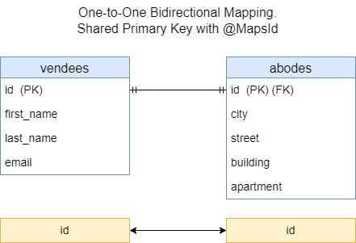

<h2>One-to-One bidirectional mapping. Shared primary key with @MapsId</h3>

* [Context](#context)
* [Database](#database)
* [Example](#example)
* [REST API](#rest-api)
* [UML](#uml)

### Context

This provides REST APIs to manipulate data in DB.
It uses One-to-One bidirectional mapping through shared primary key with `@MapsId`



### Database

Run the app (if it's not running): in IDE (IntelliJ IDEA), run

`com.example.Spring_Boot_Jpa_ER.SpringBootJpaErApplication`.

In IDE console, among other information, should appear

`...: H2 console available at '/h2-console'. Database available at 'jdbc:h2:mem:test_db'`

The `test_db` is database for manual testing of the app. It's in in-memory mode.

Start in Web-browser `localhost:8080/h2-console`.

H2 console login page appears. The page has:

```text

JDBC URL: jdbc:h2:mem:test_db
User Name: root
Password: (empty field)

```

Click button `Connect`. H2 database console should appear.
This console already has tables `VENDEES`, `ABODES`.

In SQL statement section run

```sql
SELECT * FROM VENDEES;
SELECT * FROM ABODES;
```

Click `Run`. Beneath of the SQL statement section appears
tables `VENDEES`, `ABODES`.
It's empty for now.

Data of the tables will be changed after each REST-request fulfilled.
You can check it to perform above-mentioned `SELECT` query.

### Example

Code example can be found [here](../../src/main/java/com/example/Spring_Boot_Jpa_ER/_07_1_to_1_bidir_spk_mapsid).


### REST API

To test REST API you can use [Postman](https://www.postman.com/) as a testing tool.

This REST API allows to manipulate with data in DB:

| Method    | URL                      | Action                   |
|-----------|--------------------------|--------------------------|
| GET       | `/api/v1/vendees`        | Get all Vendees          | 
| GET       | `/api/v1/abodes/vendees` | Get all Vendees by Abode | 
| GET       | `/api/v1/vendees/{id}`   | Get a Vendee by id       |
| POST      | `/api/v1/vendees`        | Add new Vendee           |
| PUT       | `/api/v1/vendees/{id}`   | Update a Vendee by id    |
| DELETE    | `/api/v1/vendees/{id}`   | Delete a Vendee by id    |


Run the app (if it's not running). Test REST API URLs in Postman.

Get all Vendees
```text
GET http://localhost:8080/api/v1/vendees
```
The REST-request can be run in following ways:
* Data do not exist.
* Data exist.

Get all Vendees by Abode
```text
GET http://localhost:8080/api/v1/abodes/vendees
```
The REST-request can be run in following ways:
* Data do not exist.
* Data exist.

Get Vendee by id `id` (e.g., `id` is `1`)
```text
GET http://localhost:8080/api/v1/vendees/1
```
The REST-request can be run in following ways:
* `id` does not exist (no data with such `id`).
* `id` exists.

Add new Vendee
```text
POST http://localhost:8080/api/v1/vendees
```
The following JSON-objects are sample request bodies
for separate REST-requests to add data:
```json
{
  "firstName": "Alice",
  "lastName": "Sunny",
  "email": "alice@mail.com",
  "city": "LightCity",
  "street": "Rainbow St.",
  "building": "15A",
  "apartment": "125C"
}
```
```json
{
  "firstName": "Bob",
  "lastName": "Green",
  "email": "bob@mail.com",
  "city": "LightCity",
  "street": "Moon St.",
  "building": "23",
  "apartment": "56"
}
```
```json
{
  "firstName": "Lucy",
  "lastName": "Moon",
  "email": "moon@mail.com",
  "city": "Freeburg",
  "street": "Broad Rd.",
  "building": "14",
  "apartment": "97"
}
```
```json
{
  "firstName": "Tom",
  "lastName": "Clark",
  "email": "tom@mail.com",
  "city": "Freeburg",
  "street": "Swift St.",
  "building": "17",
  "apartment": "188"
}
```

Update a Vendee by `id` (e.g., `id` is `2`)
```text
PUT http://localhost:8080/api/v1/vendees/2
```
request body
```json
{
  "firstName": "Bob",
  "lastName": "Green",
  "email": "bob.green@mail.com",
  "city": "LightCity",
  "street": "Winter St.",
  "building": "21",
  "apartment": "84"
}
```
The REST-request can be run in following ways:
* `id` does not exist (no data with such `id`).
* `id` exists.

Delete a Vendee by `id` (e.g., `id` is `3`)
```text
DELETE http://localhost:8080/api/v1/vendees/3
```
The REST-request can be run in following ways:
* `id` does not exist (no data with such `id`).
* `id` exists.
* Run the REST-request with the same `id` once more.

Postman collection can be found [here](./REST_API_One-to-One_BiDir_SPK_MAPSID.postman_collection.json).


### UML

UML class-diagram can be found [here](./1-to-1-bidir-spk-mapsid-uml.puml).
To read and preview PlantUML (`.puml`) files in IntelliJ IDEA, you need
to install the `plantuml4idea` plugin.
