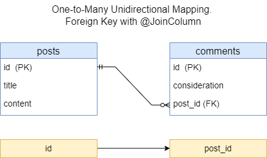

<h2>One-to-Many unidirectional mapping. Foreign key with @JoinColumn</h3>

* [Context](#context)
* [Database](#database)
* [Example](#example)
* [REST API](#rest-api)
* [UML](#uml)

### Context

This provides REST APIs to manipulate data in DB.
It uses One-to-Many unidirectional mapping through foreign key with `@JoinColumn`



### Database

Run the app (if it's not running): in IDE (IntelliJ IDEA), run

`com.example.Spring_Boot_Jpa_ER.SpringBootJpaErApplication`.

In IDE console, among other information, should appear

`...: H2 console available at '/h2-console'. Database available at 'jdbc:h2:mem:test_db'`

The `test_db` is database for manual testing of the app. It's in in-memory mode.

Start in Web-browser `localhost:8080/h2-console`.

H2 console login page appears. The page has:

```text

JDBC URL: jdbc:h2:mem:test_db
User Name: root
Password: (empty field)

```

Click button `Connect`. H2 database console should appear.
This console already has tables `POSTS`, `COMMENTS`.

In SQL statement section run

```sql
SELECT * FROM POSTS;
SELECT * FROM COMMENTS;
```

Click `Run`. Beneath of the SQL statement section appears
tables `POSTS`, `COMMENTS`.
It's empty for now.

Data of the tables will be changed after each REST-request fulfilled.
You can check it to perform above-mentioned `SELECT` query.

### Example

Code example can be found [here](../../src/main/java/com/example/Spring_Boot_Jpa_ER/_08_1_to_N_unidir_fk_jc).


### REST API

To test REST API you can use [Postman](https://www.postman.com/) as a testing tool.

This REST API allows to manipulate with data in DB:

| Method    | URL                           | Action                      |
|-----------|-------------------------------|-----------------------------|
| GET       | `/api/v1/posts`               | Get all Posts               | 
| GET       | `/api/v1/posts/{id}`          | Get a Post by id            |
| POST      | `/api/v1/posts`               | Add new Post                |
| PUT       | `/api/v1/posts/{id}`          | Update a Post by id         |
| DELETE    | `/api/v1/posts/{id}`          | Delete a Post by id         |
| GET       | `/api/v1/posts/{id}/comments` | Get all Comments by Post id | 
| GET       | `/api/v1/comments/{id}`       | Get a Comment by id         |
| POST      | `/api/v1/posts/{id}/comments` | Add new Comment by Post id  |
| PUT       | `/api/v1/comments/{id}`       | Update a Comment by id      |
| DELETE    | `/api/v1/comments/{id}`       | Delete a Comment by id      |


Run the app (if it's not running). Test REST API URLs in Postman.

1. Get all Posts.
Trying to get data, that do not exist.
```text
GET http://localhost:8080/api/v1/posts
```

2. Get all Comments by Post id.
Trying to get data, that do not exist.
```text
GET http://localhost:8080/api/v1/posts/1/comments
```

3. Get Post by id.
Trying to get data, that do not exist.
```text
GET http://localhost:8080/api/v1/posts/1
```

4. Get Comment by id.
Trying to get data, that do not exist.
```text
GET http://localhost:8080/api/v1/comments/1
```

5. Update Post by id.
Trying to update data, that do not exist.
```text
PUT http://localhost:8080/api/v1/posts/1
```
Demo request body:
```json
{
  "title": "Fruits",
  "content": "Fruits are very tasty and useful."
}
```

6. Update Comment by id.
Trying to update data, that do not exist.
```text
PUT http://localhost:8080/api/v1/comments/1
```
Demo request body:
```json
{
  "consideration": "It can be discussed."
}
```

7. Delete Post by id.
Trying to delete data, that do not exist.
```text
DELETE http://localhost:8080/api/v1/posts/1
```

8. Delete Comment by id.
Trying to delete data, that do not exist.
```text
DELETE http://localhost:8080/api/v1/comments/1
```

9. Add new Post
```text
POST http://localhost:8080/api/v1/posts
```
The following JSON-objects are sample request bodies
for separate REST-requests to add data:
```json
{
  "title": "Fruits",
  "content": "Fruits are very useful for eating."
}
```
```json
{
  "title": "About animals",
  "content": "Animals are very funny creatures."
}
```
```json
{
  "title": "Football game",
  "content": "Football as a game is very common in many countries."
}
```

10. Add Comment 1 by Post id 1.
Adds Comment by existing Post id.
```text
POST http://localhost:8080/api/v1/posts/1/comments
```
Demo request body:
```json
{
  "consideration": "Good thinking."
}
```

11. Get all Posts (exist).
Gets data, that exist.
```text
GET http://localhost:8080/api/v1/posts
```

12. Add Comment 2 by Post id 1.
Adds Comment by existing Post id.
```text
POST http://localhost:8080/api/v1/posts/1/comments
```
Demo request body:
```json
{
  "consideration": "Good thinking."
}
```

13. Get all Posts.
Gets data, that exist.
```text
GET http://localhost:8080/api/v1/posts
```

14. Add Comment 1 by Post id 3.
Adds Comment by existing Post id.
```text
POST http://localhost:8080/api/v1/posts/3/comments
```
Demo request body:
```json
{
  "consideration": "Interesting thoughts."
}
```

15. Get all Posts.
Gets data, that exist.
```text
GET http://localhost:8080/api/v1/posts
```

16. Add Comment 1 by Post id 27.
Trying to add Comment by not existing Post id.
```text
POST http://localhost:8080/api/v1/posts/27/comments
```
Demo request body:
```json
{
  "consideration": "Good thinking."
}
```

17. Get existing Comments by Post id 1.
Gets all existing Comments by existing Post id 1.
```text
GET http://localhost:8080/api/v1/posts/1/comments
```

18. Get not existing Comments by Post id 2.
Trying to get all Comments by existing Post id. 
The Comments are not existing at all.
```text
GET http://localhost:8080/api/v1/posts/2/comments
```

19. Get Post by id 1.
Gets data by existing Post id.
```text
GET http://localhost:8080/api/v1/posts/1
```

20. Get Comment by id 1.
Gets data by existing Comment id.
```text
GET http://localhost:8080/api/v1/comments/1
```

21. Update Post by id 2.
Updates Post by existing id 2.
```text
PUT http://localhost:8080/api/v1/posts/2
```
Demo request body:
```json
{
  "title": "About animals",
  "content": "Animals are very funny and clever creatures."
}
```
You can check the update with getting all Posts 
or getting Post by the id.

22. Update Post by id 1.
Updates Post by existing id 1.
```text
PUT http://localhost:8080/api/v1/posts/1
```
Demo request body:
```json
{
  "title": "Fruits",
  "content": "Fruits are very tasty and useful."
}
```
You can check the update with getting all Posts
or getting Post by the id.

23. Update Comment by id 3.
Updates Comment by existing id 3.
```text
PUT http://localhost:8080/api/v1/comments/3
```
Demo request body:
```json
{
  "consideration": "It can be discussed."
}
```

24. Add new Post.
Adds new Post.
```text
POST http://localhost:8080/api/v1/posts
```
Demo request body:
```json
{
  "title": "Books",
  "content": "Books are a source of knowledge."
}
```
You can check the update with getting all Posts.

25. Add Comment 1 by Post id 4.
Adds Comment 1 by existing Post id 4.
```text
POST http://localhost:8080/api/v1/posts/4/comments
```
Demo request body:
```json
{
  "consideration": "Amazing and unbelievable!"
}
```
You can check the adding with getting all Posts.

26. Add Comment 2 by Post id 4.
Adds Comment 2 by existing Post id 4.
```text
POST http://localhost:8080/api/v1/posts/4/comments
```
Demo request body:
```json
{
  "consideration": "Good thinking."
}
```
You can check the adding with getting all Posts.

27. Delete Post by id 3.
Deletes Post by existing id 3.
```text
DELETE http://localhost:8080/api/v1/posts/3
```
You can check the deleting with getting all Posts 
or try to delete the Post again.

28. Delete Comment by id 2.
Deletes Comment by existing id 2.
```text
DELETE http://localhost:8080/api/v1/comments/2
```
You can check the deleting with getting all Posts
or try to delete the Comment again.

Postman collection can be found [here](./REST_API_One-to-Many_UniDir_FK_JC.postman_collection.json).


### UML

UML class-diagram can be found [here](./1-to-N-unidir-fk-jc-uml.puml).
To read and preview PlantUML (`.puml`) files in IntelliJ IDEA, you need
to install the `plantuml4idea` plugin.
