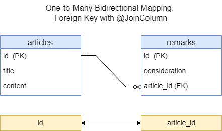

<h2>One-to-Many bidirectional mapping. Foreign key with @JoinColumn</h3>

* [Context](#context)
* [Database](#database)
* [Example](#example)
* [REST API](#rest-api)
* [UML](#uml)

### Context

This provides REST APIs to manipulate data in DB.
It uses One-to-Many bidirectional mapping through foreign key with `@JoinColumn`



### Database

Run the app (if it's not running): in IDE (IntelliJ IDEA), run

`com.example.Spring_Boot_Jpa_ER.SpringBootJpaErApplication`.

In IDE console, among other information, should appear

`...: H2 console available at '/h2-console'. Database available at 'jdbc:h2:mem:test_db'`

The `test_db` is database for manual testing of the app. It's in in-memory mode.

Start in Web-browser `localhost:8080/h2-console`.

H2 console login page appears. The page has:

```text

JDBC URL: jdbc:h2:mem:test_db
User Name: root
Password: (empty field)

```

Click button `Connect`. H2 database console should appear.
This console already has tables `ARTICLES`, `REMARKS`.

In SQL statement section run

```sql
SELECT * FROM ARTICLES;
SELECT * FROM REMARKS;
```

Click `Run`. Beneath of the SQL statement section appears
tables `ARTICLES`, `REMARKS`.
It's empty for now.

Data of the tables will be changed after each REST-request fulfilled.
You can check it to perform above-mentioned `SELECT` query.

### Example

Code example can be found [here](../../src/main/java/com/example/Spring_Boot_Jpa_ER/_09_1_to_N_bidir_fk_jc).


### REST API

To test REST API you can use [Postman](https://www.postman.com/) as a testing tool.

This REST API allows to manipulate with data in DB:

| Method    | URL                             | Action                        |
|-----------|---------------------------------|-------------------------------|
| GET       | `/api/v1/articles`              | Get all Articles              | 
| GET       | `/api/v1/articles/{id}`         | Get a Article by id           |
| POST      | `/api/v1/articles`              | Add new Article               |
| PUT       | `/api/v1/articles/{id}`         | Update a Article by id        |
| DELETE    | `/api/v1/articles/{id}`         | Delete a Article by id        |
| GET       | `/api/v1/articles/{id}/remarks` | Get all Remarks by Article id | 
| GET       | `/api/v1/remarks/{id}`          | Get a Remark by id            |
| POST      | `/api/v1/articles/{id}/remarks` | Add new Remark by Article id  |
| PUT       | `/api/v1/remarks/{id}`          | Update a Remark by id         |
| DELETE    | `/api/v1/remarks/{id}`          | Delete a Remark by id         |


Run the app (if it's not running). Test REST API URLs in Postman.

1. Get all Articles.
Trying to get data, that do not exist.
```text
GET http://localhost:8080/api/v1/articles
```

2. Get all Remarks by Article id.
Trying to get data, that do not exist.
```text
GET http://localhost:8080/api/v1/articles/1/remarks
```

3. Get Article by id.
Trying to get data, that do not exist.
```text
GET http://localhost:8080/api/v1/articles/1
```

4. Get Remark by id.
Trying to get data, that do not exist.
```text
GET http://localhost:8080/api/v1/remarks/1
```

5. Update Article by id.
Trying to update data, that do not exist.
```text
PUT http://localhost:8080/api/v1/articles/1
```
Demo request body:
```json
{
  "title": "Fruits",
  "content": "Fruits are very tasty and useful."
}
```

6. Update Remark by id.
Trying to update data, that do not exist.
```text
PUT http://localhost:8080/api/v1/remarks/1
```
Demo request body:
```json
{
  "consideration": "It can be discussed."
}
```

7. Delete Article by id.
Trying to delete data, that do not exist.
```text
DELETE http://localhost:8080/api/v1/articles/1
```

8. Delete Remark by id.
Trying to delete data, that do not exist.
```text
DELETE http://localhost:8080/api/v1/remarks/1
```

9. Add new Article
```text
POST http://localhost:8080/api/v1/articles
```
The following JSON-objects are sample request bodies
for separate REST-requests to add data:
```json
{
  "title": "Fruits",
  "content": "Fruits are very useful for eating."
}
```
```json
{
  "title": "About animals",
  "content": "Animals are very funny creatures."
}
```
```json
{
  "title": "Football game",
  "content": "Football as a game is very common in many countries."
}
```

10. Add Remark 1 by Article id 1.
Adds Remark by existing Article id.
```text
POST http://localhost:8080/api/v1/articles/1/remarks
```
Demo request body:
```json
{
  "consideration": "Good thinking."
}
```

11. Get all Articles (exist).
Gets data, that exist.
```text
GET http://localhost:8080/api/v1/articles
```

12. Add Remark 2 by Article id 1.
Adds Remark by existing Article id.
```text
POST http://localhost:8080/api/v1/articles/1/remarks
```
Demo request body:
```json
{
  "consideration": "Interesting thoughts."
}
```

13. Get all Articles.
Gets data, that exist.
```text
GET http://localhost:8080/api/v1/articles
```

14. Add Remark 1 by Article id 3.
Adds Remark by existing Article id.
```text
POST http://localhost:8080/api/v1/articles/3/remarks
```
Demo request body:
```json
{
  "consideration": "Interesting thoughts."
}
```

15. Get all Articles.
Gets data, that exist.
```text
GET http://localhost:8080/api/v1/articles
```

16. Add Remark 1 by Article id 27.
Trying to add Remark by not existing Article id.
```text
POST http://localhost:8080/api/v1/articles/27/remarks
```
Demo request body:
```json
{
  "consideration": "Good thinking."
}
```

17. Get existing Remarks by Article id 1.
Gets all existing Remarks by existing Article id 1.
```text
GET http://localhost:8080/api/v1/articles/1/remarks
```

18. Get not existing Remarks by Article id 2.
Trying to get all Remarks by existing Article id. 
The Remarks are not existing at all.
```text
GET http://localhost:8080/api/v1/articles/2/remarks
```

19. Get Article by id 1.
Gets data by existing Article id.
```text
GET http://localhost:8080/api/v1/articles/1
```

20. Get Remark by id 1.
Gets data by existing Remark id.
```text
GET http://localhost:8080/api/v1/remarks/1
```

21. Update Article by id 2.
Updates Articles by existing id 2.
```text
PUT http://localhost:8080/api/v1/articles/2
```
Demo request body:
```json
{
  "title": "About animals",
  "content": "Animals are very funny and clever creatures."
}
```
You can check the update with getting all Articles 
or getting Article by the id.

22. Update Article by id 1.
Updates Article by existing id 1.
```text
PUT http://localhost:8080/api/v1/articles/1
```
Demo request body:
```json
{
  "title": "Fruits",
  "content": "Fruits are very tasty and useful."
}
```
You can check the update with getting all Articles
or getting Article by the id.

23. Update Remark by id 3.
Updates Remark by existing id 3.
```text
PUT http://localhost:8080/api/v1/remarks/3
```
Demo request body:
```json
{
  "consideration": "It can be discussed."
}
```

24. Add new Article.
Adds new Article.
```text
POST http://localhost:8080/api/v1/articles
```
Demo request body:
```json
{
  "title": "Books",
  "content": "Books are a source of knowledge."
}
```
You can check the update with getting all Articles.

25. Add Remark 1 by Article id 4.
Adds Remark 1 by existing Article id 4.
```text
POST http://localhost:8080/api/v1/articles/4/remarks
```
Demo request body:
```json
{
  "consideration": "Amazing and unbelievable!"
}
```
You can check the adding with getting all Articles.

26. Add Remark 2 by Article id 4.
Adds Remark 2 by existing Article id 4.
```text
POST http://localhost:8080/api/v1/articles/4/remarks
```
Demo request body:
```json
{
  "consideration": "Good thinking."
}
```
You can check the adding with getting all Articles.

27. Delete Article by id 3.
Deletes Article by existing id 3.
```text
DELETE http://localhost:8080/api/v1/articles/3
```
You can check the deleting with getting all Articles 
or try to delete the Article again.

28. Delete Remark by id 2.
Deletes Remark by existing id 2.
```text
DELETE http://localhost:8080/api/v1/remarks/2
```
You can check the deleting with getting all Articles
or try to delete the Remark again.

Postman collection can be found [here](./REST_API_One-to-Many_BiDir_FK_JC.postman_collection.json).


### UML

UML class-diagram can be found [here](./1-to-N-bidir-fk-jc-uml.puml).
To read and preview PlantUML (`.puml`) files in IntelliJ IDEA, you need
to install the `plantuml4idea` plugin.
