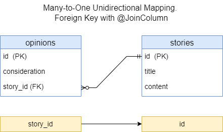

<h2>Many-to-One unidirectional mapping. Foreign key with @JoinColumn</h3>

* [Context](#context)
* [Database](#database)
* [Example](#example)
* [REST API](#rest-api)
* [UML](#uml)

### Context

This provides REST APIs to manipulate data in DB.
It uses Many-to-One unidirectional mapping through foreign key with `@JoinColumn`



### Database

Run the app (if it's not running): in IDE (IntelliJ IDEA), run

`com.example.Spring_Boot_Jpa_ER.SpringBootJpaErApplication`.

In IDE console, among other information, should appear

`...: H2 console available at '/h2-console'. Database available at 'jdbc:h2:mem:test_db'`

The `test_db` is database for manual testing of the app. It's in in-memory mode.

Start in Web-browser `localhost:8080/h2-console`.

H2 console login page appears. The page has:

```text

JDBC URL: jdbc:h2:mem:test_db
User Name: root
Password: (empty field)

```

Click button `Connect`. H2 database console should appear.
This console already has tables `STORIES`, `OPINIONS`.

In SQL statement section run

```sql
SELECT * FROM STORIES;
SELECT * FROM OPINIONS;
```

Click `Run`. Beneath of the SQL statement section appears
tables `STORIES`, `OPINIONS`.
It's empty for now.

Data of the tables will be changed after each REST-request fulfilled.
You can check it to perform above-mentioned `SELECT` query.

### Example

Code example can be found [here](../../src/main/java/com/example/Spring_Boot_Jpa_ER/_10_N_to_1_unidir_fk_jc).


### REST API

To test REST API you can use [Postman](https://www.postman.com/) as a testing tool.

This REST API allows to manipulate with data in DB:

| Method    | URL                             | Action                       |
|-----------|---------------------------------|------------------------------|
| GET       | `/api/v1/stories`               | Get all Stories              | 
| GET       | `/api/v1/stories/{id}`          | Get a Story by id            |
| POST      | `/api/v1/stories`               | Add new Story                |
| PUT       | `/api/v1/stories/{id}`          | Update a Story by id         |
| DELETE    | `/api/v1/stories/{id}`          | Delete a Story by id         |
| GET       | `/api/v1/stories/{id}/opinions` | Get all Opinions by Story id | 
| GET       | `/api/v1/opinions/{id}`         | Get an Opinion by id         |
| POST      | `/api/v1/stories/{id}/opinions` | Add new Opinion by Story id  |
| PUT       | `/api/v1/opinions/{id}`         | Update an Opinion by id      |
| DELETE    | `/api/v1/opinions/{id}`         | Delete an Opinion by id      |


Run the app (if it's not running). Test REST API URLs in Postman.

1. Get all Stories.
Trying to get data, that do not exist.
```text
GET http://localhost:8080/api/v1/stories
```

2. Get all Opinions by Story id.
Trying to get data, that do not exist.
```text
GET http://localhost:8080/api/v1/stories/1/opinions
```

3. Get Story by id.
Trying to get data, that do not exist.
```text
GET http://localhost:8080/api/v1/stories/1
```

4. Get Opinion by id.
Trying to get data, that do not exist.
```text
GET http://localhost:8080/api/v1/opinions/1
```

5. Update Story by id.
Trying to update data, that do not exist.
```text
PUT http://localhost:8080/api/v1/stories/1
```
Demo request body:
```json
{
  "title": "Fruits",
  "content": "Fruits are very tasty and useful."
}
```

6. Update Opinion by id.
Trying to update data, that do not exist.
```text
PUT http://localhost:8080/api/v1/opinions/1
```
Demo request body:
```json
{
  "consideration": "It can be discussed."
}
```

7. Delete Story by id.
Trying to delete data, that do not exist.
```text
DELETE http://localhost:8080/api/v1/stories/1
```

8. Delete Opinion by id.
Trying to delete data, that do not exist.
```text
DELETE http://localhost:8080/api/v1/opinions/1
```

9. Add new Story
```text
POST http://localhost:8080/api/v1/stories
```
The following JSON-objects are sample request bodies
for separate REST-requests to add data:
```json
{
  "title": "Fruits",
  "content": "Fruits are very useful for eating."
}
```
```json
{
  "title": "About animals",
  "content": "Animals are very funny creatures."
}
```
```json
{
  "title": "Football game",
  "content": "Football as a game is very common in many countries."
}
```

10. Add Opinion 1 by Story id 1.
Adds Opinion by existing Story id.
```text
POST http://localhost:8080/api/v1/stories/1/opinions
```
Demo request body:
```json
{
  "consideration": "Good thinking."
}
```

11. Add Opinion 2 by Story id 1.
Adds Opinion by existing Story id.
```text
POST http://localhost:8080/api/v1/stories/1/opinions
```
Demo request body:
```json
{
  "consideration": "Interesting thoughts."
}
```

12. Add Opinion 1 by Story id 3.
Adds Opinion by existing Story id.
```text
POST http://localhost:8080/api/v1/stories/3/opinions
```
Demo request body:
```json
{
  "consideration": "Interesting thoughts."
}
```

13. Get all Stories (exist).
Gets data, that exist.
```text
GET http://localhost:8080/api/v1/stories
```

14. Add Opinion 1 by Story id 27.
Trying to add Opinion by not existing Story id.
```text
POST http://localhost:8080/api/v1/stories/27/opinions
```
Demo request body:
```json
{
  "consideration": "Good thinking."
}
```

15. Get existing Opinions by Story id 1.
Gets all existing Opinions by existing Story id 1.
```text
GET http://localhost:8080/api/v1/stories/1/opinions
```

16. Get not existing Opinions by Story id 2.
Trying to get all Opinions by existing Story id. 
The Opinions are not existing at all.
```text
GET http://localhost:8080/api/v1/stories/2/opinions
```

17. Get Story by id 1.
Gets data by existing Story id.
```text
GET http://localhost:8080/api/v1/stories/1
```

18. Get Opinion by id 1.
Gets data by existing Opinion id.
```text
GET http://localhost:8080/api/v1/opinions/1
```

19. Update Story by id 2.
Updates Story by existing id 2.
```text
PUT http://localhost:8080/api/v1/stories/2
```
Demo request body:
```json
{
  "title": "About animals",
  "content": "Animals are very funny and clever creatures."
}
```
You can check the update with getting all Stories 
or getting Story by the id.

20. Update Story by id 1.
Updates Story by existing id 1.
```text
PUT http://localhost:8080/api/v1/stories/1
```
Demo request body:
```json
{
  "title": "Fruits",
  "content": "Fruits are very tasty and useful."
}
```
You can check the update with getting all Stories
or getting Story by the id.

21. Update Opinion by id 3.
Updates Opinion by existing id 3.
```text
PUT http://localhost:8080/api/v1/opinions/3
```
Demo request body:
```json
{
  "consideration": "It can be discussed."
}
```

22. Add new Story.
Adds new Story.
```text
POST http://localhost:8080/api/v1/stories
```
Demo request body:
```json
{
  "title": "Books",
  "content": "Books are a source of knowledge."
}
```
You can check the update with getting all Stories.

23. Add Opinion 1 by Story id 4.
Adds Opinion 1 by existing Story id 4.
```text
POST http://localhost:8080/api/v1/stories/4/opinions
```
Demo request body:
```json
{
  "consideration": "Amazing and unbelievable!"
}
```
You can check the adding with getting all Stories.

24. Add Opinion 2 by Story id 4.
Adds Opinion 2 by existing Story id 4.
```text
POST http://localhost:8080/api/v1/stories/4/opinions
```
Demo request body:
```json
{
  "consideration": "Good thinking."
}
```
You can check the adding with getting all Stories.

25. Delete Story by id 3.
Should delete Story by existing id 3.
```text
DELETE http://localhost:8080/api/v1/stories/3
```
If you try to delete a Story by specific id without deleting 
Opinions related to it first, you should get a `Referential integrity constraint violation`.
Stories may have reference(s) to a certain Opinion(s).
You must first delete all Opinions that are related to this Story.

Find all Opinions that are relevant to this Story
```text
GET http://localhost:8080/api/v1/stories/3/opinions
```

Delete all Opinions that are relevant to specific 
Story one by one (see the point of Deleting 
an Opinion).

You can check the deleting with getting all Stories 
or try to delete the Story again.

26. Delete Opinion by id 2.
Deletes Opinion by existing id 2.
```text
DELETE http://localhost:8080/api/v1/opinions/2
```
You can check the deleting with getting all Stories
or try to delete the Opinion again.

Postman collection can be found [here](./REST_API_Many-to-One_UniDir_FK_JC.postman_collection.json).


### UML

UML class-diagram can be found [here](./N-to-1-unidir-fk-jc-uml.puml).
To read and preview PlantUML (`.puml`) files in IntelliJ IDEA, you need
to install the `plantuml4idea` plugin.
