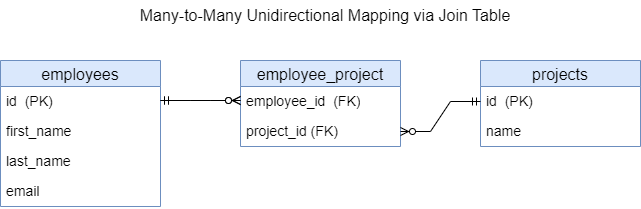

<h2>Many-to-Many unidirectional mapping via Join Table</h3>

* [Context](#context)
* [Database](#database)
* [Example](#example)
* [REST API](#rest-api)
* [UML](#uml)

### Context

This provides REST APIs to manipulate data in DB.
It uses Many-to-Many unidirectional mapping via join table



### Database

Run the app (if it's not running): in IDE (IntelliJ IDEA), run

`com.example.Spring_Boot_Jpa_ER.SpringBootJpaErApplication`.

In IDE console, among other information, should appear

`...: H2 console available at '/h2-console'. Database available at 'jdbc:h2:mem:test_db'`

The `test_db` is database for manual testing of the app. It's in in-memory mode.

Start in Web-browser `localhost:8080/h2-console`.

H2 console login page appears. The page has:

```text

JDBC URL: jdbc:h2:mem:test_db
User Name: root
Password: (empty field)

```

Click button `Connect`. H2 database console should appear.
This console already has tables `EMPLOYEES`, `PROJECTS`, `EMPLOYEE_PROJECT`.

The `EMPLOYEE_PROJECT` table is a join table between `Employee` and `Project` entities.


In SQL statement section run

```sql
SELECT * FROM EMPLOYEES;
SELECT * FROM PROJECTS;
SELECT * FROM EMPLOYEE_PROJECT;
```

Click `Run`. Beneath of the SQL statement section appears
tables `EMPLOYEES`, `PROJECTS`, `EMPLOYEE_PROJECT`.
It's empty for now.

Data of the tables will be changed after each REST-request fulfilled.
You can check it to perform above-mentioned `SELECT` query.

### Example

Code example can be found [here](../../src/main/java/com/example/Spring_Boot_Jpa_ER/_11_N_to_N_unidir_jt).


### REST API

To test REST API you can use [Postman](https://www.postman.com/) as a testing tool.

This REST API allows to manipulate with data in DB:

| Method | URL                                                   | Action                                 |
|--------|-------------------------------------------------------|----------------------------------------|
| GET    | `/api/v1/employees`                                   | Get all Employees                      | 
| GET    | `/api/v1/projects/{id}/employees`                     | Get all Employees by Project id        | 
| GET    | `/api/v1/employees/{id}`                              | Get an Employee by id                  |
| POST   | `/api/v1/employees`                                   | Add new Employee                       |
| PUT    | `/api/v1/employees/{id}`                              | Update an Employee by id               |
| DELETE | `/api/v1/employees/{id}`                              | Delete an Employee by id               |
| GET    | `/api/v1/projects`                                    | Get all Projects                       |
| GET    | `/api/v1/projects/{id}`                               | Get a Project by id                    |
| POST   | `/api/v1/projects`                                    | Add new Project                        |
| POST   | `/api/v1/employees/{id}/projects`                     | Set Project to by Employee id          |
| PUT    | `/api/v1/projects/{id}`                               | Update a Project by id                 |
| DELETE | `/api/v1/employees/{employeeId}/projects/{projectId}` | Unset a Project by id from Employee id |
| DELETE | `/api/v1/projects/{id}`                               | Delete a Project by id                 |

Run the app (if it's not running). Test REST API URLs in Postman.

1. Get all Employees.
Trying to get data, that do not exist.
```text
GET http://localhost:8080/api/v1/employees
```

2. Get Employee by id.
Trying to get data, that do not exist.
```text
GET http://localhost:8080/api/v1/employees/1
```

3. Get all Projects.
Trying to get data, that do not exist.
```text
GET http://localhost:8080/api/v1/projects
```

4. Get Project by id.
Trying to get data, that do not exist.
```text
GET http://localhost:8080/api/v1/projects/1
```

5. Get all Employees by Project id.
Trying to get data, that do not exist.
```text
GET http://localhost:8080/api/v1/projects/1/employees
```

6. Add new Employee.
```text
POST http://localhost:8080/api/v1/employees
```
The following JSON-objects are sample request bodies
for separate REST-requests to add data:
```json
{
  "firstName": "Alice",
  "lastName": "Sunny",
  "email": "alice@mail.com"
}
```
```json
{
  "firstName": "Bob",
  "lastName": "Green",
  "email": "bob@mail.com"
}
```
```json
{
  "firstName": "Lucy",
  "lastName": "Moon",
  "email": "moon@mail.com"
}
```
```json
{
  "firstName": "Tom",
  "lastName": "Clark",
  "email": "tom@mail.com"
}
```

You can check the adding with getting all Employees.

7. Add new Project.
```text
POST http://localhost:8080/api/v1/projects
```
The following JSON-objects are sample request bodies
for separate REST-requests to add data:
```json
{
  "name": "Alpha"
}
```
```json
{
  "name": "Beta"
}
```
```json
{
  "name": "Gamma"
}
```

You can check the adding with getting all Projects.

8. Set Project to by Employee id.
Employee id is in request path, Project id is in request body.
```text
POST http://localhost:8080/api/v1/employees/1/projects
```
```json
{
  "id": 1
}
```
```text
POST http://localhost:8080/api/v1/employees/1/projects
```
```json
{
  "id": 2
}
```
```text
POST http://localhost:8080/api/v1/employees/2/projects
```
```json
{
  "id": 2
}
```
```text
POST http://localhost:8080/api/v1/employees/2/projects
```
```json
{
  "id": 3
}
```
```text
POST http://localhost:8080/api/v1/employees/4/projects
```
```json
{
  "id": 2
}
```

9. Set Project to by not-existing Employee id.
```text
POST http://localhost:8080/api/v1/employees/27/projects
```
```json
{
  "id": 2
}
```

10. Get all Employees (exist).
Gets all existing Employees.
```text
GET http://localhost:8080/api/v1/employees
```

11. Get Employee by id (exist).
Gets Employee by id 1.
```text
GET http://localhost:8080/api/v1/employees/1
```

12. Get all Projects (exist).
Gets all existing Projects.
```text
GET http://localhost:8080/api/v1/projects
```

13. Get Project by id (exist).
Gets Project by id 1.
```text
GET http://localhost:8080/api/v1/projects/1
```

14. Get all Employees by Project id (exist).
Gets all Employees set to Project 1.
```text
GET http://localhost:8080/api/v1/projects/1/employees
```

15. Update Employee by id.
Employee id is in request path.
```text
PUT http://localhost:8080/api/v1/employees/1
```
```json
{
  "firstName": "Alice",
  "lastName": "Terra",
  "email": "terra@mail.com"
}
```
```text
PUT http://localhost:8080/api/v1/employees/2
```
```json
{
  "firstName": "Bob",
  "lastName": "Green",
  "email": "b.green@mail.com"
}
```

You can check the updating with getting all Employees.

16. Update Project by id.
Project id is in request path.
```text
PUT http://localhost:8080/api/v1/projects/1
```
```json
{
  "name": "Alpha +"
}
```
```text
PUT http://localhost:8080/api/v1/projects/3
```
```json
{
  "name": "Gamma +"
}
```

You can check the updating with getting all Projects.

17. Unset a Project by id from Employee id.
```text
DELETE http://localhost:8080/api/v1/employees/1/projects/1
```
```text
DELETE http://localhost:8080/api/v1/employees/4/projects/2
```

You can check the unsetting with getting all Projects and all Employees.

18. Delete Project by id 2.
Should delete Project by existing id 2.
```text
DELETE http://localhost:8080/api/v1/projects/2
```
You can get a `Referential integrity constraint violation`,
because the Project with this id has a reference to a certain Employee(s).
You must first unset this Project from all Employees that are related 
to this Project.

Find all Employees that are relevant to this Project
```text
GET http://localhost:8080/api/v1/projects/2/employees
```

You can check the deleting with getting all Projects.

19. Delete Project by id 1.
Should delete Project by existing id 1. The Project does not have any references.
```text
DELETE http://localhost:8080/api/v1/projects/1
```
You can check the deleting with getting all Projects.

20. Delete Project by id 15.
Trying to delete data, that do not exist.
```text
DELETE http://localhost:8080/api/v1/projects/15
```

21. Delete Employee by id 1.
```text
DELETE http://localhost:8080/api/v1/employees/1
```
You can check the deleting with getting all Employees 
or try to delete this Employee again. 

22. Delete Employee by id 4.
```text
DELETE http://localhost:8080/api/v1/employees/4
```
You can check the deleting with getting all Employees
or try to delete this Employee again.


Postman collection can be found [here](./REST_API_Many-to-Many_UniDir_JT.postman_collection.json).


### UML

UML class-diagram can be found [here](./N-to-N-unidir-jt-uml.puml). 
To read and preview PlantUML (`.puml`) files in IntelliJ IDEA, you need 
to install the `plantuml4idea` plugin.
