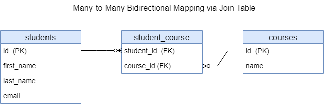

<h2>Many-to-Many bidirectional mapping via Join Table</h3>

* [Context](#context)
* [Database](#database)
* [Example](#example)
* [REST API](#rest-api)
* [UML](#uml)

### Context

This provides REST APIs to manipulate data in DB.
It uses Many-to-Many bidirectional mapping via join table



### Database

Run the app (if it's not running): in IDE (IntelliJ IDEA), run

`com.example.Spring_Boot_Jpa_ER.SpringBootJpaErApplication`.

In IDE console, among other information, should appear

`...: H2 console available at '/h2-console'. Database available at 'jdbc:h2:mem:test_db'`

The `test_db` is database for manual testing of the app. It's in in-memory mode.

Start in Web-browser `localhost:8080/h2-console`.

H2 console login page appears. The page has:

```text

JDBC URL: jdbc:h2:mem:test_db
User Name: root
Password: (empty field)

```

Click button `Connect`. H2 database console should appear.
This console already has tables `STUDENTS`, `COURSES`, `STUDENT_COURSE`.

The `STUDENT_COURSE` table is a join table between `Student` and `Course` entities.


In SQL statement section run

```sql
SELECT * FROM STUDENTS;
SELECT * FROM COURSES;
SELECT * FROM STUDENT_COURSE;
```

Click `Run`. Beneath of the SQL statement section appears
tables `STUDENTS`, `COURSES`, `STUDENT_COURSE`.
It's empty for now.

Data of the tables will be changed after each REST-request fulfilled.
You can check it to perform above-mentioned `SELECT` query.

### Example

Code example can be found [here](../../src/main/java/com/example/Spring_Boot_Jpa_ER/_12_N_to_N_bidir_jt).


### REST API

To test REST API you can use [Postman](https://www.postman.com/) as a testing tool.

This REST API allows to manipulate with data in DB:

| Method | URL                                               | Action                               |
|--------|---------------------------------------------------|--------------------------------------|
| GET    | `/api/v1/students`                                | Get all Students                     | 
| GET    | `/api/v1/courses/{id}/students`                   | Get all Students by Course id        | 
| GET    | `/api/v1/students/{id}`                           | Get a Student by id                  |
| POST   | `/api/v1/students`                                | Add new Student                      |
| PUT    | `/api/v1/students/{id}`                           | Update a Student by id               |
| DELETE | `/api/v1/students/{id}`                           | Delete a Student by id               |
| GET    | `/api/v1/courses`                                 | Get all Courses                      |
| GET    | `/api/v1/students/{id}/courses`                   | Get all Courses by Student id        |
| GET    | `/api/v1/courses/{id}`                            | Get a Course by id                   |
| POST   | `/api/v1/courses`                                 | Add new Course                       |
| POST   | `/api/v1/students/{id}/courses`                   | Set Course to by Student id          |
| PUT    | `/api/v1/courses/{id}`                            | Update a Course by id                |
| DELETE | `/api/v1/students/{studentId}/courses/{courseId}` | Unset a Course by id from Student id |
| DELETE | `/api/v1/courses/{id}`                            | Delete a Course by id                |

Run the app (if it's not running). Test REST API URLs in Postman.

1. Get all Students.
Trying to get data, that do not exist.
```text
GET http://localhost:8080/api/v1/students
```

2. Get Student by id.
Trying to get data, that do not exist.
```text
GET http://localhost:8080/api/v1/students/1
```

3. Get all Courses.
Trying to get data, that do not exist.
```text
GET http://localhost:8080/api/v1/courses
```

4. Get Course by id.
Trying to get data, that do not exist.
```text
GET http://localhost:8080/api/v1/courses/1
```

5. Get all Courses by Student id.
Trying to get data, that do not exist.
```text
GET http://localhost:8080/api/v1/students/1/courses
```

6. Get all Students by Course id.
Trying to get data, that do not exist.
```text
GET http://localhost:8080/api/v1/courses/1/students
```

7. Add new Student.
```text
POST http://localhost:8080/api/v1/students
```
The following JSON-objects are sample request bodies
for separate REST-requests to add data:
```json
{
  "firstName": "Alice",
  "lastName": "Sunny",
  "email": "alice@mail.com"
}
```
```json
{
  "firstName": "Bob",
  "lastName": "Green",
  "email": "bob@mail.com"
}
```
```json
{
  "firstName": "Lucy",
  "lastName": "Moon",
  "email": "moon@mail.com"
}
```
```json
{
  "firstName": "Tom",
  "lastName": "Clark",
  "email": "tom@mail.com"
}
```

You can check the adding with getting all Students.

8. Add new Course.
```text
POST http://localhost:8080/api/v1/courses
```
The following JSON-objects are sample request bodies
for separate REST-requests to add data:
```json
{
  "name": "Alpha"
}
```
```json
{
  "name": "Beta"
}
```
```json
{
  "name": "Gamma"
}
```

You can check the adding with getting all Courses.

9. Set Course to by Student id.
Student id is in request path, Course id is in request body.
```text
POST http://localhost:8080/api/v1/students/1/courses
```
```json
{
  "id": 1
}
```
```text
POST http://localhost:8080/api/v1/students/1/courses
```
```json
{
  "id": 2
}
```
```text
POST http://localhost:8080/api/v1/students/2/courses
```
```json
{
  "id": 2
}
```
```text
POST http://localhost:8080/api/v1/students/2/courses
```
```json
{
  "id": 3
}
```
```text
POST http://localhost:8080/api/v1/students/4/courses
```
```json
{
  "id": 2
}
```

10. Set Course to by not-existing Student id.
```text
POST http://localhost:8080/api/v1/students/27/courses
```
```json
{
  "id": 2
}
```

11. Get all Students (exist).
Gets all existing Students.
```text
GET http://localhost:8080/api/v1/students
```

12. Get Student by id (exist).
Gets Student by id 1.
```text
GET http://localhost:8080/api/v1/students/1
```

13. Get all Courses (exist).
Gets all existing Courses.
```text
GET http://localhost:8080/api/v1/courses
```

14. Get Course by id (exist).
Gets Course by id 1.
```text
GET http://localhost:8080/api/v1/courses/1
```

15. Get all Courses by Student id (exist).
Gets all Courses set to Student 1.
```text
GET http://localhost:8080/api/v1/students/1/courses
```

16. Get all Students by Course id (exist).
Gets all Students set to Course 1.
```text
GET http://localhost:8080/api/v1/courses/1/students
```

17. Update Student by id.
Student id is in request path.
```text
PUT http://localhost:8080/api/v1/students/1
```
```json
{
  "firstName": "Alice",
  "lastName": "Terra",
  "email": "terra@mail.com"
}
```
```text
PUT http://localhost:8080/api/v1/students/2
```
```json
{
  "firstName": "Bob",
  "lastName": "Green",
  "email": "b.green@mail.com"
}
```

You can check the updating with getting all Students.

18. Update Course by id.
Course id is in request path.
```text
PUT http://localhost:8080/api/v1/courses/1
```
```json
{
  "name": "Alpha +"
}
```
```text
PUT http://localhost:8080/api/v1/courses/3
```
```json
{
  "name": "Gamma +"
}
```

You can check the updating with getting all Courses.

19. Unset a Course by id from Student id.
```text
DELETE http://localhost:8080/api/v1/students/1/courses/1
```
```text
DELETE http://localhost:8080/api/v1/students/4/courses/2
```

You can check the unsetting with getting all Courses and all Students.

20. Delete Course by id 2.
Should delete Course by existing id 2.
```text
DELETE http://localhost:8080/api/v1/courses/2
```
You can get a `Referential integrity constraint violation`,
because the Course with this id has a reference to a certain Student(s).
You must first unset this Course from all Students that are related 
to this Course.

Find all Students that are relevant to this Course
```text
GET http://localhost:8080/api/v1/courses/2/students
```

You can check the deleting with getting all Courses.

21. Delete Course by id 1.
Should delete Course by existing id 1. The Course does not have any references.
```text
DELETE http://localhost:8080/api/v1/courses/1
```
You can check the deleting with getting all Courses.

22. Delete Course by id 15.
Trying to delete data, that do not exist.
```text
DELETE http://localhost:8080/api/v1/courses/15
```

23. Delete Student by id 1.
```text
DELETE http://localhost:8080/api/v1/students/1
```
You can check the deleting with getting all Students 
or try to delete this Student again. 

24. Delete Student by id 4.
```text
DELETE http://localhost:8080/api/v1/students/4
```
You can check the deleting with getting all Students
or try to delete this Student again.


Postman collection can be found [here](./REST_API_Many-to-Many_BiDir_JT.postman_collection.json).


### UML

UML class-diagram can be found [here](./N-to-N-bidir-jt-uml.puml). 
To read and preview PlantUML (`.puml`) files in IntelliJ IDEA, you need 
to install the `plantuml4idea` plugin.
